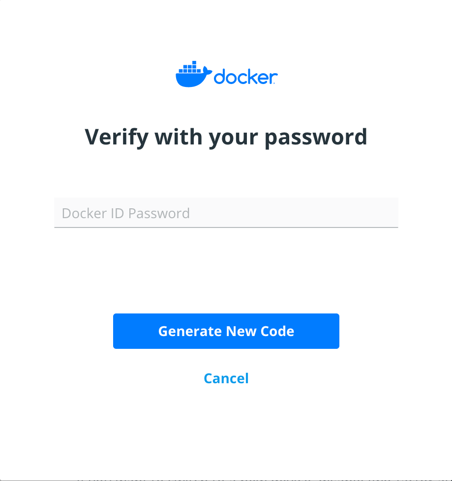


If you have lost your two-factor authentication recovery code and still have
access to your Docker Hub account, you can generate a new recovery code.

２要素認証のリカバリーコードが不明ながら、Docker Hub アカウントにアクセスはできている場合、新たなリカバリーコードを生成することができます。


## Prerequisites

{: #prerequisites }
## 前提条件

Two-factor authentication is enabled on your Docker Hub account.

Docker Hub アカウントにおいて２要素認証が有効であるとします。


## Generate a new recovery code

{: #generate-a-new-recovery-code }
## 新たなリカバリーコードの生成


To disable two-factor authentication, log in to your Docker Hub account. Click
on your username and select **Account Settings**.  Go to **Security** and click
on **Click here to generate a new code**.

まずは２要素認証を無効にするために、Docker Hub アカウントにログインします。
ユーザー名をクリックして **Account Settings** を実行します。
**Security** にアクセスして **Click here to generate a new code**（ここをクリックして新たなコードを生成）をクリックします。






Enter your password.

パスワードを入力します。


{:width="250px"}

{:width="250px"}


Your new recovery code will be displayed. Remember to save your recovery code
and store it somewhere safe.

新たなリカバリーコードが表示されます。
このリカバリーコードを書きとめておき、どこか安全な場所に保存してください。
