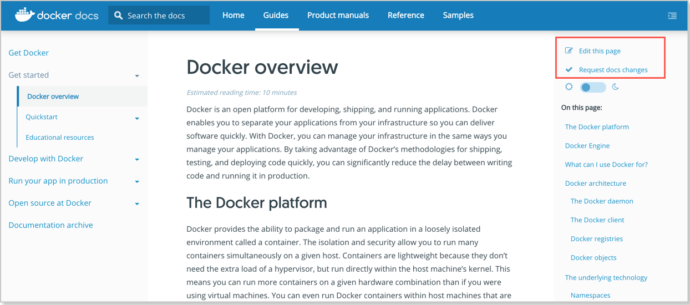



Contributing to the Docker documentation can be a rewarding experience. When you
offer feedback, questions, edits, or new content, you help us, the projects you
work on, and the larger Docker community.


We welcome your participation to help make the documentation better!

We welcome your participation to help make the documentation better!


> Looking for the open source Moby project?
>
> See [Looking for Moby?](#looking-for-moby) below.

> オープンソース Moby プロジェクトを探していますか？
>
> その場合は後述する [Moby を探していますか？](#looking-for-moby) を参照してください。


## How to contribute to the docs

{: #how-to-contribute-to-the-docs }
## 本ドキュメントへの貢献方法


The documentation for Docker is published at
[docs.docker.com](https://docs.docker.com/).

Docker ドキュメントは [docs.docker.com](https://docs.docker.com/) において公開されています。


There are many ways to contribute:

貢献方法はいくつもあります。


- Edit, rate, or file an issue or question directly on the site by
using the links available on the right-side menu on every page
at [docs.docker.com](/).

- Edit, rate, or file an issue or question directly on the site by
using the links available on the right-side menu on every page
at [docs.docker.com](/).

  
  
  
  


- File a documentation issue on GitHub at
[https://github.com/docker/docker.github.io/issues](https://github.com/docker/docker.github.io/issues).

- File a documentation issue on GitHub at
[https://github.com/docker/docker.github.io/issues](https://github.com/docker/docker.github.io/issues).

  
  This is similar to clicking **Request doc changes** on a published docs
  page, but if you manually file an issue you need to fill in links to
  the related pages.
  
  This is similar to clicking **Request doc changes** on a published docs
  page, but if you manually file an issue you need to fill in links to
  the related pages.



- Fork the documentation, make changes or add new content on your local
branch, and submit a pull request (PR) to the master branch for the docs.

  
  
  This is the manual, more advanced version of clicking **Edit this page**
  on a published docs page. Initiating a docs changes in a PR from your
  own branch gives you more flexibility, as you can submit changes to
  multiple pages or files under a single pull request, and even create
  new topics.


## Resources and guidance

{: #resources-and-guidance }
## Resources and guidance


We are here to help. If you are interested in contributing, but don't feel ready
to dive in on more complex updates, we can help get you up and running.

We are here to help. If you are interested in contributing, but don't feel ready
to dive in on more complex updates, we can help get you up and running.


You might start by using the right-side menus on published pages:

You might start by using the right-side menus on published pages:


* Click **Request doc changes** on a page to automatically log an issue.

* Click **Request doc changes** on a page to automatically log an issue.


* Click **Edit this page** to make a change to content, which automatically creates a PR.

* Click **Edit this page** to make a change to content, which automatically creates a PR.


The issue and PR pages on GitHub give us a community space to discuss
things, and answer any questions you might have about the problem or topic you
are reporting on.

The issue and PR pages on GitHub give us a community space to discuss
things, and answer any questions you might have about the problem or topic you
are reporting on.


To learn more about working on the documentation, see these topics:

To learn more about working on the documentation, see these topics:


- [README on docker/docker.github.io](https://github.com/docker/docker.github.io/blob/master/README.md)

- [docker/docker.github.io の README](https://github.com/docker/docker.github.io/blob/master/README.md)


- [Docs Test page](../test.md) - This is on the
published site. It explains how to use Docs components, resources, and
formats, and gives us a way to test and demo them.

- [Docs Test page](../test.md) - This is on the
published site. It explains how to use Docs components, resources, and
formats, and gives us a way to test and demo them.


## Looking for meetups and Docker Community?

## Looking for meetups and Docker Community?


Go to the [Docker Community GitHub repository](https://github.com/docker/community/blob/master/README.md){:target="_blank" class="_"}
for resources and information on the community.

Go to the [Docker Community GitHub repository](https://github.com/docker/community/blob/master/README.md){:target="_blank" class="_"}
for resources and information on the community.


The topics in this guide on [Other ways to contribute](/opensource/ways/)
provide some additional information,  but the community
information you are looking for is probably available on the GitHub repository.

The topics in this guide on [Other ways to contribute](/opensource/ways/)
provide some additional information,  but the community
information you are looking for is probably available on the GitHub repository.


## Looking for Moby?

{: #looking-for-moby }
## Moby を探していますか？


